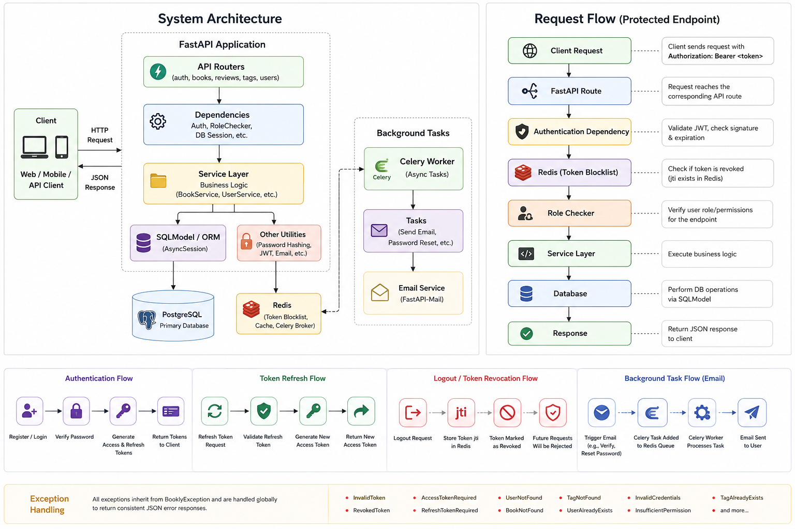

# 📚 Bookly Backend


A production-style REST API for a **Book Management System** built with **FastAPI**, **PostgreSQL**, **SQLModel**, **Redis**, and **Celery**. The application features secure JWT authentication, role-based authorization, asynchronous background processing, and a modular service-oriented architecture.

---

## ✨ Features

- 🔐 JWT Authentication (Access & Refresh Tokens)
- 👤 User Registration & Login
- 🛡 Role-Based Access Control (RBAC)
- 📧 Email Verification
- 🔑 Password Reset via Email
- 📚 CRUD Operations for Books
- ⭐ Book Reviews
- 🏷 Book Tagging & Search
- 🚫 Redis-backed Token Revocation (Logout)
- ⚡ Asynchronous Email Processing using Celery
- 🗄 Database Migrations with Alembic
- 📜 Request Logging Middleware
- ❗ Centralized Exception Handling

---

## 🛠 Tech Stack

| Category | Technologies |
|----------|--------------|
| Backend | FastAPI |
| Database | PostgreSQL |
| ORM | SQLModel + SQLAlchemy |
| Authentication | JWT (PyJWT), Passlib (Bcrypt) |
| Cache & Queue | Redis |
| Background Tasks | Celery |
| Email | FastAPI-Mail |
| Migrations | Alembic |

---

## 🏗 System Architecture

<p align="center">
  
</p>

---

## 📂 Project Structure

```text
src/
├── auth/
├── books/
├── db/
├── reviews/
├── tags/
├── tests/
├──__init__.py
├── celery_tasks.py
├── config.py
├── errors.py
├── mail.py
└── middleware.py

migrations/
requirements.txt
```

---

## 🔒 Security

- Password hashing using **Bcrypt**
- JWT Access & Refresh Tokens
- Redis-backed token revocation
- Role-based authorization
- Email verification
- Password reset via secure email links
- CORS and Trusted Host middleware

---

## 🚀 Running Locally

### Clone the repository

```bash
git clone https://github.com/AnkitP1603/Bookly-FastAPI.git
cd Bookly-FastAPI
```

### Create a virtual environment

```bash
python -m venv .venv
```

### Activate the environment

**Linux / macOS**

```bash
source .venv/bin/activate
```

**Windows**

```powershell
.venv\Scripts\activate
```

### Install dependencies

```bash
pip install -r requirements.txt
```

### Configure environment variables

Create a `.env` file and configure the required values.

Example:

```env
DATABASE_URL = 
JWT_SECRET = 
JWT_ALGORITHM = 
REDIS_HOST = 
REDIS_PORT = 

MAIL_USERNAME=
MAIL_PASSWORD=
MAIL_PORT=
MAIL_SERVER=
MAIL_FROM_NAME=
MAIL_FROM=

DOMAIN=
```

### Apply database migrations

```bash
alembic upgrade head
```

### Start Redis

```bash
redis-server
```

### Run the FastAPI server

```bash
uvicorn src:app --reload
```

### Start the Celery worker

```bash
celery -A src.celery_tasks.c_app worker --loglevel=info
```

---
